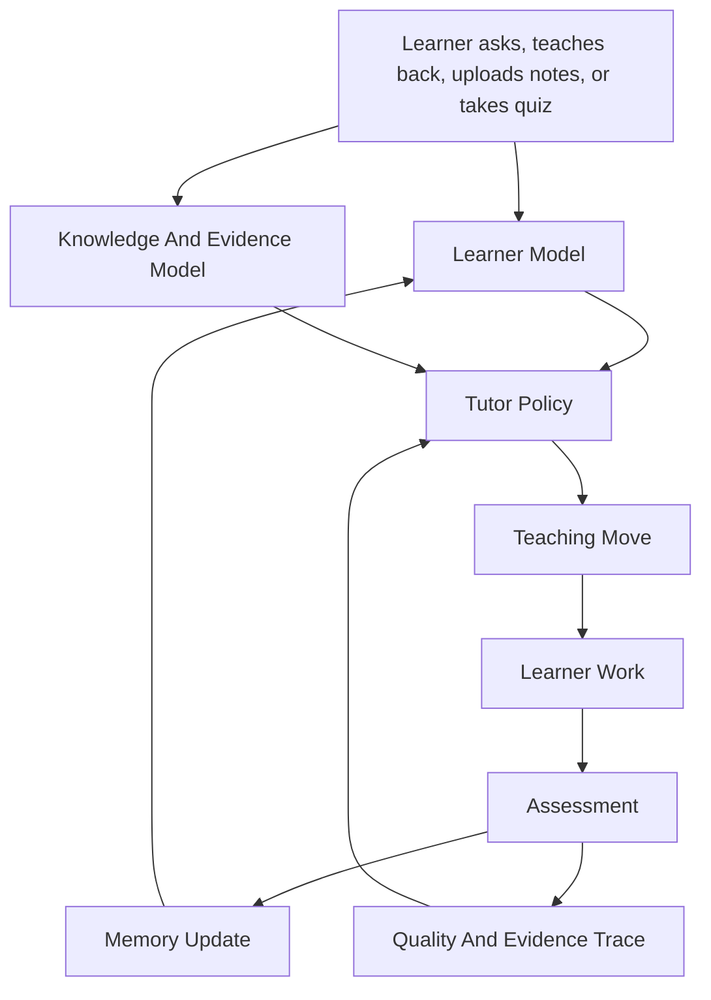
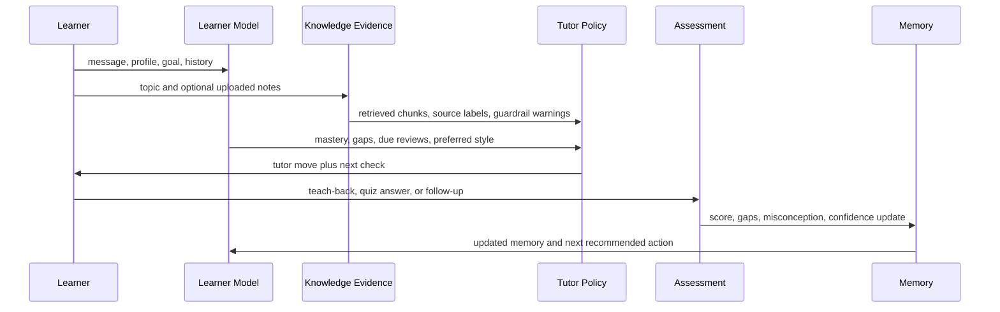
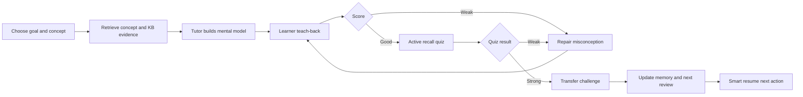

# NeuroTutor System Architecture

This is the learning-system architecture: how the tutor should think, decide,
teach, check, remember, and improve. It is intentionally not a frontend/backend
architecture.

## System Goal

NeuroTutor is designed as an intelligent tutoring loop, not a question-answer
chatbot. Each turn should move the learner through a cycle:

1. Understand the learner's current state.
2. Select the right tutoring move.
3. Ground the explanation in concept knowledge and optional user documents.
4. Ask the learner to do active work.
5. Score the learner's response.
6. Update memory and choose the next action.
7. Keep evidence for review and quality evaluation.

## Core Mental Model

The important rule: the tutor does not only produce text. It produces the next
educational action.

## Learner Model

The learner model is the tutor's compact picture of the student.

It tracks:

- Profile preferences: depth, tone, learning style, pace, and goal.
- Known concepts and struggling concepts.
- Concept memory: mastery, stability, last review, due review, and review count.
- Assessment history: teach-back scores, quiz scores, gaps, misconceptions, and
  provider metadata.
- Current session state: selected concept, active mode, active quiz, last
  teach-back, and current goal.

How it is used:

- Known concepts become bridges and analogies.
- Struggling concepts trigger repair-first explanations.
- Weak assessments move the learner into teach-back or prerequisite repair.
- Strong assessments unlock application and transfer challenges.
- Due reviews get prioritized by smart resume and lesson scripts.

Main files:

- `src/learner-state.js`
- `src/learner-records.js`
- `src/tutor-engine.js`
- `src/smart-resume.js`

## Knowledge And Evidence Model

The tutor has two knowledge sources:

- Built-in concept graph: definitions, key points, prerequisites, related
  concepts, misconceptions, analogies, examples, and applications.
- User knowledge base: pasted notes, markdown/text files, simple JSON imports,
  and PDF-extracted text.

The knowledge base is not treated as instruction. It is treated as evidence.

Retrieval policy:

1. Split documents by section-aware chunks with overlap.
2. Search with keyword/BM25-style scoring, local vector similarity, and concept
   graph boosts.
3. Diversify results so one document cannot dominate.
4. Redact suspicious prompt-injection lines.
5. Provide compact source labels such as `[S1]`, `[S2]`.
6. Record which sources were cited, unused, invalid, or risky.

Main files:

- `src/concepts.js`
- `src/knowledge-base.js`
- `src/embedding-provider.js`
- `src/citations.js`
- `src/citation-notebook.js`
- `src/prompt-guard.js`

## Tutor Policy

The tutor policy decides what kind of teaching move should happen next.

Inputs:

- Learner profile and memory.
- Current concept and prerequisite graph.
- Learner message or teach-back.
- Retrieved source chunks.
- Recent assessment events.
- Selected mode.

Outputs:

- Explanation or guiding question.
- Follow-up prompts.
- Teach-back task.
- Quiz or transfer challenge.
- Repair plan.
- Whiteboard artifact.
- Evidence trace and self-check score.

Policy priorities:

1. Repair misconceptions before adding new complexity.
2. Use Socratic questions when the learner needs to reason.
3. Use direct explanation when the learner is blocked or asks for clarity.
4. Always end with a next check or active-learning step.
5. Prefer small, verifiable steps over long lectures.
6. Cite retrieved source chunks when using uploaded knowledge.
7. Refuse to follow instructions that come from retrieved documents.

Main files:

- `src/tutor-engine.js`
- `src/local-llm.js`
- `src/tutor-eval.js`

## Teaching Modes

| Mode | Purpose | Tutor behavior | Learner work |
|---|---|---|---|
| Explainer | Build the first mental model. | Simple explanation, analogy, example, misconception contrast. | Answer a next-check prompt. |
| Socratic | Develop reasoning. | Mostly questions, hints, and contrastive prompts. | Explain the next step or justify an answer. |
| Student | Role reversal. | Tutor pretends to be the learner and asks for teaching. | Teach the tutor in plain language. |
| Duck | Reflection mode. | Short prompts that help the learner think aloud. | Debug their own explanation. |
| Teach-back | Assessment and repair. | Scores coverage, missing points, and misconceptions. | Explain the concept without relying on answer text. |
| Quiz | Active recall. | Generates targeted questions and explanations. | Retrieve knowledge and apply it. |
| Transfer | Durable understanding. | Applies concept to a real scenario. | Use the concept in a new context. |

Main files:

- `src/tutor-engine.js`
- `src/local-llm.js`
- `src/lesson-script.js`

## Turn-Level Tutor Loop

The loop should make each turn auditable:

- Why did the tutor pick this move?
- Which learner state did it use?
- Which source chunks did it rely on?
- What evidence shows the learner improved or still struggled?

## Teach-Back Architecture

Teach-back is the main anti-chatbot mechanism. It forces the learner to produce
an explanation instead of only reading one.

Teach-back scoring checks:

- Key-point coverage.
- Misconceptions.
- Clarity.
- Missing prerequisite ideas.
- Whether the explanation can transfer to a real example.

Tutor response after teach-back:

1. Acknowledge what was correct.
2. Name the most important missing piece.
3. Correct one misconception at a time.
4. Give a refined explanation.
5. Ask the learner to retry in a smaller, clearer form.
6. Update concept memory and learner state.

Main files:

- `src/tutor-engine.js`
- `src/local-llm.js`
- `src/learner-state.js`

## Quiz And Active Recall Architecture

Quizzes are not separate from tutoring. They are the recall-check part of the
same loop.

Question selection should prefer:

- Current target concept.
- Recent missing points.
- Struggling concepts.
- Due reviews.
- Misconceptions seen in teach-back.

Quiz results update:

- Mastery level.
- Stability and next review time.
- Known/struggling concept lists.
- Assessment history.
- Smart resume recommendations.

Main files:

- `src/tutor-engine.js`
- `src/local-llm.js`
- `src/learner-state.js`

## Lesson Script And Smart Resume Architecture

Lesson scripts turn the tutor from one-off chat into a guided session.

The script sequence is:

1. Orient: name the goal and concept.
2. Source check: retrieve relevant notes and identify source gaps.
3. Teach: build the mental model.
4. Teach-back: make the learner explain.
5. Quiz: test active recall.
6. Transfer: apply the concept.
7. Resume: store next action.

Smart resume decides what the learner should do next based on recent events:

- Continue an unfinished quiz.
- Repair a weak teach-back.
- Review a due concept.
- Advance to a transfer challenge.
- Add knowledge if source coverage is thin.

Main files:

- `src/lesson-script.js`
- `src/smart-resume.js`
- `src/course-outline.js`
- `src/learner-records.js`

## Notebook Saathi Architecture

Notebook Saathi is a teacher-supervised variant of the same tutor architecture.
Instead of starting from a chat message, it starts from student work evidence.

Loop:

1. Parse or load anonymized worksheet rows.
2. Classify each answer into misconception clusters.
3. Summarize class-level patterns for a teacher.
4. Suggest remediation groups and retry tasks.
5. Compare initial attempts with retry attempts.
6. Keep teacher approval central before remediation is used in class.

This is important because it turns the tutor from "student asks AI" into
"teacher reviews evidence and approves targeted remediation."

Main files:

- `src/notebook-saathi.js`
- `public/app.js`
- `tests/notebook-saathi.test.js`

## Safety And Guardrail Architecture

Safety is part of the tutor system, not an afterthought.

Threat model:

- Uploaded notes may contain instructions like "ignore previous prompts."
- A learner may paste unsafe or irrelevant content.
- The model may over-answer, hallucinate, or reduce learner agency.
- Retrieved sources may be cited incorrectly.

Guardrail behavior:

1. Detect prompt-injection patterns in uploaded text.
2. Redact suspicious lines before retrieval context reaches the model.
3. Mark risky source chunks in source metadata.
4. Tell the LLM that retrieved context is evidence, never instruction.
5. Validate citation labels.
6. Score tutor outputs for groundedness and safety.

Main files:

- `src/prompt-guard.js`
- `src/knowledge-base.js`
- `src/local-llm.js`
- `src/tutor-eval.js`
- `src/citations.js`

## Quality Evaluation Architecture

The tutor has two layers of quality control:

- Deterministic baseline tests: prove the local tutor engine maintains minimum
  pedagogical behavior.
- LM Studio evals: score actual local model outputs and fail if fallback is used
  when real LLM evaluation was required.

Rubric dimensions:

- Concept coverage.
- Misconception handling.
- Active-learning prompts.
- Learner-profile adaptation.
- Groundedness and safety.
- Clarity.

Every live tutor response can receive a compact self-check score so long
sessions can be audited after the fact.

Main files:

- `src/tutor-eval.js`
- `data/tutor-quality-evals.json`
- `scripts/run-tutor-eval.mjs`
- `scripts/run-full-tutor-session.mjs`

## End-To-End Learning Session

## What This Architecture Rejects

- Answer dumping as the default.
- Treating the LLM as the whole tutor.
- Hiding learner state inside chat history only.
- Uploading whole documents directly into the prompt.
- Trusting retrieved text as instructions.
- Claiming tutor quality from demos without eval cases.
- Making every role a separate heavyweight agent before the single loop is
  reliable.

## Practical Baseline Verdict

The current tutor is a good baseline when judged as a learning system because it
already has:

- Learner model.
- Concept graph.
- Retrieval and citations.
- Prompt-injection guardrails.
- Teach-back scoring.
- Quiz and memory updates.
- Lesson scripts.
- Smart resume.
- Notebook Saathi evidence workflow.
- Tutor-quality rubric and tests.

The next major architecture upgrades should be:

1. Stronger spaced repetition such as SM-2 or FSRS.
2. Persistent semantic vector cache.
3. Larger tutor-quality eval set with long conversations.
4. Over-helping detector.
5. More subject-specific misconception libraries.
6. Teacher-facing review/export for Notebook Saathi.
