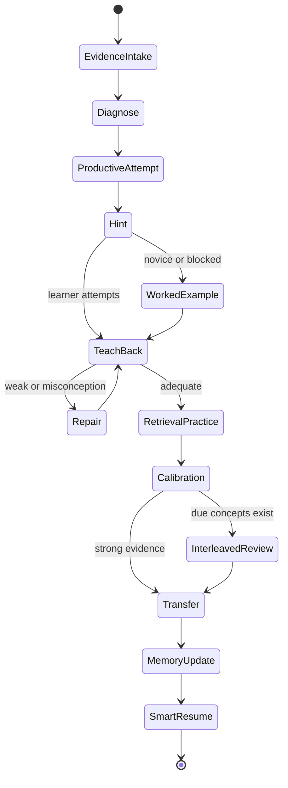
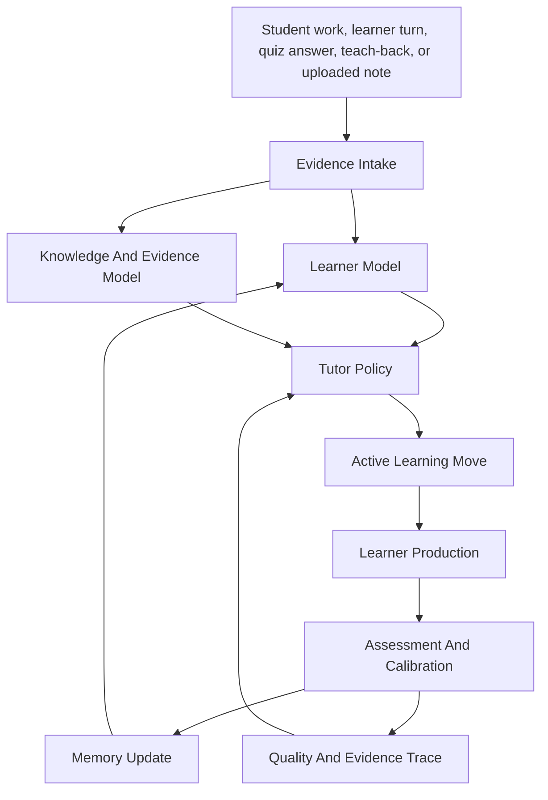
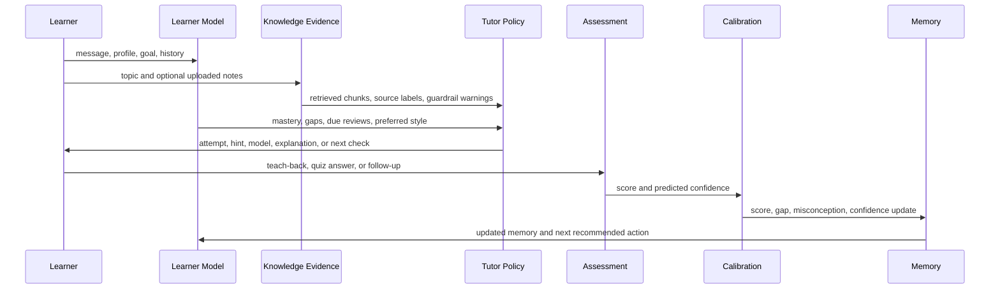
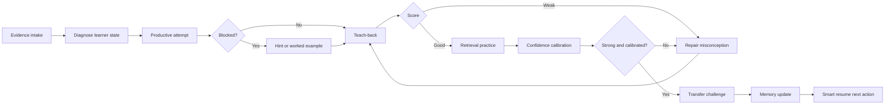

# NeuroTutor System Architecture

This is the learning-system architecture: how the tutor should think, decide,
teach, check, remember, and improve. It is intentionally not a frontend/backend
architecture.

## System Goal

NeuroTutor is designed as an intelligent tutoring loop, not a question-answer
chatbot. Each turn should move the learner through a cycle:

1. Understand the learner's current state.
2. Select the right tutoring move.
3. Ground the explanation in concept knowledge and optional user documents.
4. Ask the learner to do active work.
5. Score the learner's response.
6. Update memory and choose the next action.
7. Keep evidence for review and quality evaluation.

The system has two supported entry points:

- `Notebook Saathi`: teacher-supervised work-evidence flow. The system starts
  from student worksheet/notebook attempts, diagnoses misconception clusters,
  and creates guarded remediation tasks.
- `NeuroTutor`: learner-driven active-learning flow. The system starts from a
  concept, goal, message, teach-back, quiz, or uploaded knowledge source and
  runs the active-construction loop.

Both entry points use the same learning engine: diagnose, scaffold, require
learner production, assess, update memory, and choose the next step.

## Feynman Learning Contract

Feynman is used here as a system test for understanding, not as a loose
inspiration. The tutor should keep asking until the learner can:

1. Explain the idea in plain language.
2. Name the mechanism, not only the label.
3. Give an example and a non-example.
4. Identify the common trap or misconception.
5. Transfer the idea to a new case.
6. Say what evidence would prove the explanation wrong.

This contract is grounded in Feynman's emphasis on mechanism, plain
explanation, and not fooling oneself, then implemented through teach-back,
retrieval, contradiction repair, calibration, and transfer.

## Active-Construction Architecture

The tutor must make the learner construct knowledge, not passively ingest
answers. This is the system's learning-science contract.

| Engine | Tutor rule | Learner action | System status |
|---|---|---|---|
| Productive failure front-end | Start hard concepts with an attempt, prediction, or partial problem before giving full instruction. | Generate an initial representation or solution attempt. | Partially implemented through teach-back, quizzes, and next checks; full problem-first gating is TODO. |
| Self-explanation and elaborative interrogation | After instruction, require an explanation in the learner's own words and ask why/how questions around weak claims. | Explain why the idea works, where it applies, and what would break if a misconception were true. | Implemented through teach-back scoring; stronger claim extraction and why/how follow-up routing are TODO. |
| Hint-first Socratic coaching | When the learner asks for the answer, prefer a hint, contrast, or guiding question. | Derive the next step instead of receiving the final answer. | Implemented in Socratic mode; global answer-leakage guard and post-response answer filter are TODO. |
| Spaced retrieval and interleaving | Due reviews should be retrieval attempts, not rereading; mix related concepts to force discrimination. | Recall, apply, and compare concepts from memory. | Lightweight review exists; FSRS/interleaving upgrade is TODO. |
| Cognitive apprenticeship with adaptive fading | Show expert reasoning for novices, then remove support as mastery rises. | Move from worked example to completion problem to independent transfer. | Whiteboard/worked-example artifacts exist; BKT/FSRS-driven fading is TODO. |
| Metacognitive calibration | Ask for confidence before checks, then compare prediction with actual performance. | Notice overconfidence or underconfidence. | Profile confidence exists; explicit prediction-vs-result calibration is TODO. |
| Concept mapping and criss-cross transfer | For complex topics, revisit one concept across multiple cases and lenses. | Identify what stays invariant and what changes by case. | Transfer challenges and whiteboard artifacts exist; learner-generated concept maps and multi-case mode are TODO. |
| Implicit contradiction repair | When a learner states something that conflicts with stronger prior knowledge, pause practice and force self-correction. | Rewrite the claim, name the cue, and retest the corrected relation. | Implemented for faster/slower comparison conflicts; broader semantic contradiction checks are TODO. |

Default priority order:

1. Attempt: ask the learner to predict, solve, retrieve, map, or explain.
2. Hint: give the smallest useful scaffold.
3. Model: show expert reasoning or a worked example only when appropriate for
   the learner state.
4. Explain: provide concise instruction after useful struggle or when the
   learner is blocked.
5. Check: require teach-back, retrieval, transfer, or retry.
6. Calibrate: compare confidence with actual performance.
7. Fade: reduce scaffolding after repeated evidence of mastery.

## Learning State Machine

State responsibilities:

- `EvidenceIntake`: collect learner message, worksheet rows, quiz answer,
  teach-back, uploaded notes, current concept, and goal.
- `Diagnose`: infer concept, prerequisite gap, misconception, confidence risk,
  and whether the source should be trusted only as evidence.
- `ProductiveAttempt`: require a learner-generated attempt before full
  instruction when the task is suitable.
- `Hint`: provide minimal guidance without answer disclosure.
- `WorkedExample`: show expert reasoning for novices or blocked learners, then
  fade support.
- `TeachBack`: require the learner to explain the idea in their own words.
- `RetrievalPractice`: check recall and application without rereading.
- `Calibration`: compare predicted confidence with score.
- `InterleavedReview`: mix related due concepts instead of blocked practice.
- `Transfer`: apply the idea to a new case.
- `MemoryUpdate`: update mastery, stability, known/struggling concepts, and
  learner events.
- `SmartResume`: choose the next best action.

## Core Mental Model

The important rule: the tutor does not only produce text. It produces the next
educational action and records why that action was chosen.

## Learner Model

The learner model is the tutor's compact picture of the student.

It tracks:

- Profile preferences: depth, tone, learning style, pace, and goal.
- Known concepts and struggling concepts.
- Concept memory: mastery, stability, last review, due review, and review count.
- Assessment history: teach-back scores, quiz scores, gaps, misconceptions, and
  provider metadata.
- Calibration evidence: predicted confidence, actual score, and the gap between
  them.
- Scaffolding level: worked example, completion problem, hint, independent
  attempt, or transfer.
- Current session state: selected concept, active mode, active quiz, last
  teach-back, and current goal.

How it is used:

- Known concepts become bridges and analogies.
- Struggling concepts trigger repair-first explanations.
- Weak assessments move the learner into teach-back or prerequisite repair.
- Strong assessments unlock application and transfer challenges.
- Due reviews get prioritized by smart resume and lesson scripts.
- Overconfidence triggers calibration feedback, not reassurance.
- Repeated mastery fades scaffolding.

Main files:

- `src/learner-state.js`
- `src/learner-records.js`
- `src/tutor-engine.js`
- `src/smart-resume.js`

## Knowledge And Evidence Model

The tutor has two knowledge sources:

- Built-in concept graph: definitions, key points, prerequisites, related
  concepts, misconceptions, analogies, examples, and applications.
- User knowledge base: pasted notes, markdown/text files, simple JSON imports,
  and PDF-extracted text.

The knowledge base is not treated as instruction. It is treated as evidence.
Retrieved context should support instruction and source-grounded feedback, but
it should not short-circuit retrieval practice or self-explanation.

Retrieval policy:

1. Split documents by section-aware chunks with overlap.
2. Search with keyword/BM25-style scoring, local vector similarity, and concept
   graph boosts.
3. Diversify results so one document cannot dominate.
4. Redact suspicious prompt-injection lines.
5. Provide compact source labels such as `[S1]`, `[S2]`.
6. Record which sources were cited, unused, invalid, or risky.

Main files:

- `src/concepts.js`
- `src/knowledge-base.js`
- `src/embedding-provider.js`
- `src/citations.js`
- `src/citation-notebook.js`
- `src/prompt-guard.js`

## Tutor Policy

The tutor policy decides what kind of teaching move should happen next.

Inputs:

- Learner profile and memory.
- Current concept and prerequisite graph.
- Learner message or teach-back.
- Retrieved source chunks.
- Recent assessment events.
- Selected mode.

Outputs:

- Explanation or guiding question.
- Follow-up prompts.
- Teach-back task.
- Quiz or transfer challenge.
- Repair plan.
- Whiteboard artifact.
- Evidence trace and self-check score.

Policy priorities:

1. Repair misconceptions before adding new complexity.
2. Prefer productive learner action before direct instruction.
3. Use hints and Socratic questions before final answers.
4. Use worked examples for novices or blocked learners, then fade them.
5. Use direct explanation when the learner is blocked or after a productive
   attempt has prepared the problem space.
6. Always end with a next check or active-learning step.
7. Prefer small, verifiable steps over long lectures.
8. Cite retrieved source chunks when using uploaded knowledge.
9. Refuse to follow instructions that come from retrieved documents.
10. Avoid answer leakage when the pedagogically correct move is a hint.
11. Track whether the learner actually follows the requested learning step.

Main files:

- `src/tutor-engine.js`
- `src/local-llm.js`
- `src/tutor-eval.js`

## Teaching Modes

| Mode | Purpose | Tutor behavior | Learner work |
|---|---|---|---|
| Productive attempt | Prepare the problem space before instruction. | Presents an incomplete, ill-structured, or prediction-first task. | Attempt, predict, or sketch a first representation. |
| Explainer | Build the first mental model after a useful attempt or block. | Simple explanation, analogy, example, misconception contrast. | Answer a next-check prompt. |
| Socratic | Develop reasoning. | Mostly questions, hints, and contrastive prompts. | Explain the next step or justify an answer. |
| Student | Role reversal. | Tutor pretends to be the learner and asks for teaching. | Teach the tutor in plain language. |
| Duck | Reflection mode. | Short prompts that help the learner think aloud. | Debug their own explanation. |
| Teach-back | Assessment and repair. | Scores coverage, missing points, and misconceptions. | Explain the concept without relying on answer text. |
| Quiz | Active recall. | Generates targeted questions and explanations. | Retrieve knowledge and apply it. |
| Calibration | Metacognitive check. | Compares predicted confidence with performance. | Predict confidence before scoring and reflect on the gap. |
| Transfer | Durable understanding. | Applies concept to a real scenario. | Use the concept in a new context. |

Main files:

- `src/tutor-engine.js`
- `src/local-llm.js`
- `src/lesson-script.js`

## Turn-Level Tutor Loop

The loop should make each turn auditable:

- Why did the tutor pick this move?
- Which learner state did it use?
- Which source chunks did it rely on?
- What evidence shows the learner improved or still struggled?

## Teach-Back Architecture

Teach-back is the main anti-chatbot mechanism. It forces the learner to produce
an explanation instead of only reading one.

Teach-back scoring checks:

- Key-point coverage.
- Misconceptions.
- Clarity.
- Missing prerequisite ideas.
- Whether the explanation can transfer to a real example.

Tutor response after teach-back:

1. Acknowledge what was correct.
2. Name the most important missing piece.
3. Ask one targeted why/how or contrast question before giving a correction
   when the learner can still reason through it.
4. Correct one misconception at a time if the learner is blocked.
5. Give a refined explanation only after the learner has attempted the repair.
6. Ask the learner to retry in a smaller, clearer form.
7. Update concept memory and learner state.

Main files:

- `src/tutor-engine.js`
- `src/local-llm.js`
- `src/learner-state.js`

## Quiz And Active Recall Architecture

Quizzes are not separate from tutoring. They are the recall-check part of the
same loop.

Question selection should prefer:

- Current target concept.
- Recent missing points.
- Struggling concepts.
- Due reviews.
- Misconceptions seen in teach-back.
- Interleaved related concepts that are easy to confuse.

Quiz results update:

- Mastery level.
- Stability and next review time.
- Known/struggling concept lists.
- Assessment history.
- Smart resume recommendations.
- Calibration gap between predicted and actual performance.

Main files:

- `src/tutor-engine.js`
- `src/local-llm.js`
- `src/learner-state.js`

## Lesson Script And Smart Resume Architecture

Lesson scripts turn the tutor from one-off chat into a guided session.

The script sequence is:

1. Orient: name the goal and concept.
2. Productive attempt: make the learner try, predict, or retrieve first.
3. Source check: retrieve relevant notes and identify source gaps.
4. Model or teach: use a hint, worked example, or short explanation based on
   learner state.
5. Teach-back: make the learner explain.
6. Quiz: test active recall.
7. Calibration: compare confidence with performance.
8. Transfer: apply the concept.
9. Resume: store next action.

Smart resume decides what the learner should do next based on recent events:

- Continue an unfinished quiz.
- Repair a weak teach-back.
- Review a due concept.
- Advance to a transfer challenge.
- Add knowledge if source coverage is thin.

Main files:

- `src/lesson-script.js`
- `src/smart-resume.js`
- `src/course-outline.js`
- `src/learner-records.js`

## Notebook Saathi Architecture

Notebook Saathi is a teacher-supervised variant of the same tutor architecture.
Instead of starting from a chat message, it starts from student work evidence.
This is a system entry point, not a marketing story.

Loop:

1. Parse or load anonymized worksheet rows.
2. Classify each answer into misconception clusters.
3. Preserve evidence for each classification.
4. Summarize class-level patterns for a teacher.
5. Suggest remediation groups and retry tasks.
6. Require teacher approval before remediation is used in class.
7. Send approved groups into the same active-construction loop: hint, retry,
   teach-back, retrieval, calibration, and transfer.
8. Compare initial attempts with retry attempts.

This is important because it turns the tutor from "student asks AI" into
"teacher reviews evidence and approves targeted remediation." The engine remains
the same; only the intake surface changes.

Main files:

- `src/notebook-saathi.js`
- `public/app.js`
- `tests/notebook-saathi.test.js`

## Safety And Guardrail Architecture

Safety is part of the tutor system, not an afterthought.

Threat model:

- Uploaded notes may contain instructions like "ignore previous prompts."
- A learner may paste unsafe or irrelevant content.
- The model may over-answer, hallucinate, or reduce learner agency.
- A learner may try to extract a final answer instead of doing the learning
  step.
- The tutor may over-scaffold and create dependency.
- Retrieved sources may be cited incorrectly.

Guardrail behavior:

1. Detect prompt-injection patterns in uploaded text.
2. Redact suspicious lines before retrieval context reaches the model.
3. Mark risky source chunks in source metadata.
4. Tell the LLM that retrieved context is evidence, never instruction.
5. Validate citation labels.
6. Score tutor outputs for groundedness and safety.
7. Treat answer leakage and over-helping as tutor-quality failures.
8. Track whether the learner followed the requested learning action.

Main files:

- `src/prompt-guard.js`
- `src/knowledge-base.js`
- `src/local-llm.js`
- `src/tutor-eval.js`
- `src/citations.js`

## Quality Evaluation Architecture

The tutor has two layers of quality control:

- Deterministic baseline tests: prove the local tutor engine maintains minimum
  pedagogical behavior.
- LM Studio evals: score actual local model outputs and fail if fallback is used
  when real LLM evaluation was required.

Rubric dimensions:

- Concept coverage.
- Misconception handling.
- Active-learning prompts.
- Learner-profile adaptation.
- Groundedness and safety.
- Clarity.
- Answer-leakage resistance.
- Scaffold fading.
- Learner uptake of the requested learning action.
- Calibration feedback.

Every live tutor response can receive a compact self-check score so long
sessions can be audited after the fact.

Main files:

- `src/tutor-eval.js`
- `data/tutor-quality-evals.json`
- `scripts/run-tutor-eval.mjs`
- `scripts/run-full-tutor-session.mjs`

## End-To-End Learning Session

## What This Architecture Rejects

- Answer dumping as the default.
- Open-ended multi-turn chat without pedagogical constraints.
- Rereading as the default review activity.
- Blocked practice when interleaving is possible.
- Constant scaffolding that never fades.
- Reassurance that hides calibration gaps.
- Corrections before the learner has made a meaningful attempt, when a hint
  would be enough.
- RAG/source grounding that gives away retrieval-practice answers.
- Treating the LLM as the whole tutor.
- Hiding learner state inside chat history only.
- Uploading whole documents directly into the prompt.
- Trusting retrieved text as instructions.
- Claiming tutor quality from demos without eval cases.
- Making every role a separate heavyweight agent before the single loop is
  reliable.

## Practical Baseline Verdict

The current tutor is a good baseline when judged as a learning system because it
already has:

- Learner model.
- Concept graph.
- Retrieval and citations.
- Prompt-injection guardrails.
- Teach-back scoring.
- Quiz and memory updates.
- Lesson scripts.
- Smart resume.
- Notebook Saathi evidence workflow.
- Tutor-quality rubric and tests.

The next major architecture upgrades should be:

1. Productive-failure problem-first entry for new concepts.
2. Confidence prediction before retrieval plus prediction-vs-score feedback.
3. Interleaved review queue across related concepts.
4. Adaptive scaffolding fade-out from worked example to independent transfer.
5. Answer-leakage and over-helping detector.
6. Stronger spaced repetition such as FSRS.
7. BKT-style interpretable learner-state update for `P(knows)`.
8. Learner-generated concept maps for criss-cross transfer.
9. Teacher-facing review/export for Notebook Saathi.
10. Persistent semantic vector cache.
11. Larger tutor-quality eval set with long conversations.
12. More subject-specific misconception libraries.
