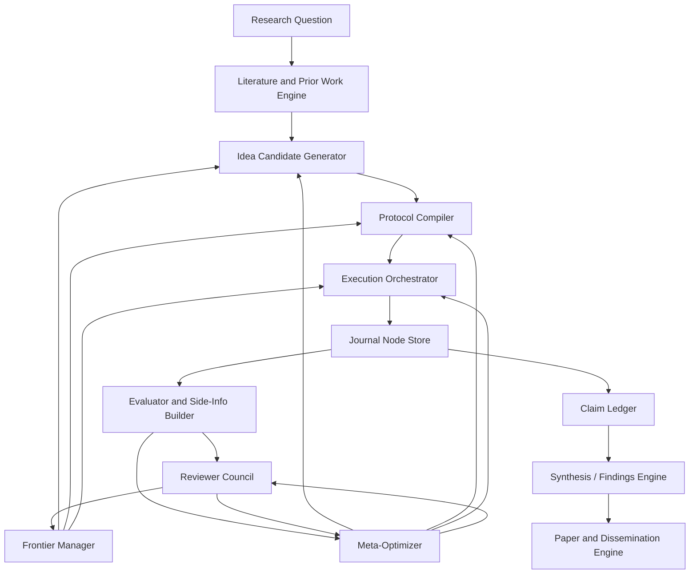

# HyperResearch-2: A Cross-Analyzed Unified Autoresearch Paradigm

> This is the rigorous version. It does not merely merge names from an awesome
> list. It extracts mechanisms from source code and papers, identifies the
> real interface boundaries, and defines a unified framework that can absorb the
> strongest existing autoresearch systems without pretending they are all the
> same thing.

## 0. Correction: What Was Wrong With the First Draft

The first draft was a useful conceptual sketch, but it was not the proper way
to unify powerful existing tools.

A proper unification requires:

1. Source-code analysis of the actual control loops.
2. Paper-level extraction of the claimed algorithms and evaluations.
3. A mechanism matrix showing what each framework really contributes.
4. A failure-mode matrix showing what each framework does not solve.
5. A common set of interfaces that can host those mechanisms.
6. A principled arbitration layer for when mechanisms disagree.
7. An evidence ledger tying final claims back to experiments, reviews, and
   source-derived constraints.

This document performs that stricter synthesis over representative high-impact
systems:

- Karpathy `autoresearch`
- Sakana `AI-Scientist`
- Sakana `AI-Scientist-v2`
- WecoAI `aideml` / AIDE
- GEPA / `optimize_anything`
- ADAS paper
- Agent Laboratory paper
- the local Codex autoresearch skill model

It does not claim every item in the original awesome list was deeply audited.
Instead, it creates the unification substrate that can ingest additional tools
through adapters.

## 1. Source-Derived Mechanism Extraction

### 1.1 Karpathy Autoresearch

**Actual mechanism:** minimal metric-driven code improvement loop.

From `program.md` and repo structure:

- One mutable file: `train.py`.
- Evaluation/data file is read-only: `prepare.py`.
- Fixed wall-clock training budget of 5 minutes.
- Single hard metric: validation bits-per-byte, lower is better.
- Agent commits a change, runs training, reads metric, keeps or discards.
- `results.tsv` records commit, metric, memory, status, and description.
- Crashes are logged and either fixed quickly or abandoned.
- The loop is intentionally narrow so diffs remain reviewable.

**What it contributes:**

- ruthless experiment comparability,
- fixed budget,
- simple keep/revert semantics,
- metric discipline,
- minimal mutable surface area.

**What it lacks:**

- literature review,
- novelty checking,
- hypothesis management,
- paper writing,
- multi-objective evaluation,
- tree search beyond a single branch,
- robust cross-project memory.

### 1.2 AI Scientist v1

**Actual mechanism:** end-to-end idea-to-paper pipeline.

From `launch_scientist.py`, `generate_ideas.py`, `perform_experiments.py`,
`perform_writeup.py`, and `perform_review.py`:

- Generates ideas from a task prompt, seed ideas, and the existing experiment
  code.
- Uses reflection rounds to improve each idea.
- Checks novelty through Semantic Scholar or OpenAlex queries.
- Copies a template project into an idea-specific result folder.
- Uses Aider to edit `experiment.py`, `plot.py`, `notes.txt`, and LaTeX files.
- Runs bounded experiments with `python experiment.py --out_dir=run_i`.
- Keeps baseline results available for comparison.
- Generates plots and writes detailed notes for the writeup.
- Produces a LaTeX paper.
- Adds citations through API search and BibTeX insertion.
- Reviews the generated paper with an ensemble of LLM reviewers and a
  meta-reviewer.
- Optionally improves the paper based on review.

**What it contributes:**

- automated idea generation,
- literature novelty checks,
- experiment-writeup-review integration,
- structured notes as a bridge from experiments to paper,
- ensemble review and improvement loop.

**What it lacks:**

- strong protocol pre-registration,
- general source-agnostic execution interfaces,
- robust long-running state beyond result folders,
- deep branch/population search in v1,
- hard claim-to-evidence enforcement.

### 1.3 AI Scientist v2

**Actual mechanism:** staged agentic tree search plus writeup/review.

From `launch_scientist_bfts.py`, `perform_experiments_bfts_with_agentmanager.py`,
`agent_manager.py`, `journal.py`, and `bfts_config.yaml`:

- Loads pre-generated ideas and converts each to Markdown/JSON.
- Runs BFTS-style experiments through an agent manager.
- Uses a `Journal` of `Node` objects representing a solution tree.
- Nodes store plan, code, plot code, execution output, parsed metrics,
  failures, plot analysis, VLM feedback, datasets tested, and parent/child
  relations.
- Uses staged research:
  - initial implementation,
  - baseline tuning,
  - creative research,
  - ablation studies.
- Uses multiple workers and multiple drafts.
- Selects best nodes with a mixture of metrics and LLM judgment.
- Uses VLM feedback for plot/caption/figure review.
- Tracks tokens and produces logs, reports, plot aggregation, writeups, and
  reviews.

**What it contributes:**

- research as staged tree search,
- journaled solution trees,
- separate phases for baseline, creative work, and ablation,
- VLM-based visual feedback,
- richer node state than a scalar metric,
- stronger paper-generation pipeline.

**What it lacks:**

- a clean universal adapter boundary,
- proof that all stage transitions are scientifically valid,
- explicit claim ledger,
- easy replacement of search policies,
- small/simple deployment path.

### 1.4 AIDE / `aideml`

**Actual mechanism:** tree search over ML code solutions.

From `aide/run.py`, `aide/agent.py`, and `aide/journal.py`:

- Prepares a workspace and task description.
- Maintains a `Journal` of code solution `Node`s.
- Agent search policy:
  - create initial drafts until `num_drafts`,
  - sometimes debug buggy leaf nodes if under `max_debug_depth`,
  - otherwise improve the current best good node.
- Each response contains a natural-language plan plus a single code block.
- Interpreter executes the generated code in a workspace.
- Feedback model parses output into:
  - bug flag,
  - summary,
  - metric,
  - lower-is-better flag.
- Best node is selected by validation metric.
- Generates a final report from the journal.

**What it contributes:**

- clean code-search journal abstraction,
- draft/debug/improve node taxonomy,
- explicit tree structure,
- practical executor boundary,
- simple report generation.

**What it lacks:**

- scientific novelty evaluation,
- literature grounding,
- paper-quality claim discipline,
- multi-stage research semantics in base AIDE,
- reviewer council beyond metric/output parsing.

### 1.5 GEPA / `optimize_anything`

**Actual mechanism:** reflective text evolution over any serializable artifact.

From `optimize_anything.py`, candidate selectors, and GEPA paper:

- Optimizes any text-representable candidate: prompt, code, config, policy,
  architecture, SVG, etc.
- User supplies an evaluator returning score and optional side information.
- Supports:
  - single-task search,
  - multi-task search,
  - generalization over held-out validation tasks.
- Treats actionable side information as the text analogue of a gradient.
- Uses reflective mutation to propose new candidates.
- Preserves Pareto-efficient candidates instead of collapsing everything into
  one average score too early.
- Supports candidate-selection strategies:
  - Pareto,
  - current best,
  - epsilon-greedy,
  - top-k Pareto.
- Supports caching, budgets, stopping conditions, tracking, and optional
  merge proposer.

**What it contributes:**

- universal text-artifact optimization interface,
- side-information-driven reflection,
- Pareto frontier preservation,
- multi-task transfer,
- clean API around evaluator/candidate/search.

**What it lacks:**

- full scientific project lifecycle,
- native literature/paper/reviewer stack,
- protocol locking,
- evidence ledger semantics,
- autonomous experiment environment management.

### 1.6 ADAS

**Paper-level mechanism:** meta-agent search over agent architectures.

The ADAS paper frames agent design itself as an optimization target. Its key
move is to let a meta-agent write new agent systems in code, keep an archive of
discoveries, and evaluate those systems across tasks.

**What it contributes:**

- search over agent architectures,
- code-defined agents as evolvable artifacts,
- archive-driven discovery,
- transfer of agent designs across domains.

**What it lacks for scientific autoresearch:**

- direct experiment/paper lifecycle,
- source-grounded citation workflow,
- scientific claim discipline,
- domain-specific lab execution stack.

### 1.7 Agent Laboratory

**Paper-level mechanism:** staged research assistant workflow.

Agent Laboratory organizes research into literature review, experimentation,
and report writing, with human feedback improving stage quality.

**What it contributes:**

- practical human-in-the-loop stage gates,
- end-to-end research artifact generation,
- explicit stage separation,
- cost-aware autonomous research pipeline.

**What it lacks:**

- deep meta-optimization of the agent loop,
- rigorous source-code tree search like AIDE,
- Pareto candidate management like GEPA,
- universal adapter interface.

### 1.8 Local Codex Autoresearch Skill

**Actual mechanism:** two-loop autonomous research management.

The local skill defines:

- bootstrap,
- inner experiment loop,
- outer synthesis loop,
- `research-state.yaml`,
- `findings.md`,
- experiment directories,
- literature files,
- progress reports,
- agent continuity loop,
- git protocol for protocol-before-results.

**What it contributes:**

- project memory discipline,
- continuity across turns,
- findings as evolving paper backbone,
- protocol locking,
- progress reporting,
- pragmatic orchestration across domain skills.

**What it lacks:**

- implementation of a concrete code-search engine,
- built-in Pareto candidate frontier,
- built-in AI Scientist style reviewer/writeup ensemble,
- built-in ADAS/GEPA meta-optimization.

## 2. Cross-Analysis Matrix

| System | Primary Unit | Search Shape | Evaluation | Memory | Output | Best Use |
|---|---|---|---|---|---|---|
| Karpathy autoresearch | code commit | linear keep/revert | fixed metric | TSV/log | better code | narrow metric optimization |
| AI Scientist v1 | idea folder | idea batch + bounded runs | results + paper review | notes/result dirs | paper | idea-to-paper automation |
| AI Scientist v2 | journal node | staged tree search | metric + LLM/VLM feedback | journal/logs | paper/report | research tree exploration |
| AIDE | code node | draft/debug/improve tree | metric parsed from run output | journal | code + report | ML/code competitions |
| GEPA | text candidate | reflective Pareto evolution | evaluator + side info | frontier/cache | optimized artifact | prompts/code/config/policy |
| ADAS | agent architecture | meta-agent archive search | benchmark score | archive | better agents | agent-system invention |
| Agent Laboratory | research stage | stage pipeline | human/LLM assessment | stage artifacts | report/code | collaborative research assistant |
| Codex autoresearch skill | project state | inner/outer loop | experiment evidence | findings/state | progress/paper | long-horizon orchestration |

## 3. Core Insight: They Optimize Different Objects

The mistake is to say "all autoresearch frameworks are loops." They are loops,
but over different objects:

| Object being optimized | Framework examples |
|---|---|
| code implementation | Karpathy, AIDE, AI Scientist experiments |
| scientific idea | AI Scientist, Agent Laboratory |
| branch of a research tree | AI Scientist-v2, AIDE |
| prompt/text artifact | GEPA |
| agent architecture | ADAS, GEPA optimize-anything |
| paper draft | AI Scientist, Agent Laboratory |
| reviewer response | AI Scientist review/improvement |
| whole research policy | ADAS, GEPA, bilevel autoresearch |

Therefore, the right unification is not one giant loop. It is a typed substrate
where every optimizable object is represented as a candidate with:

- serialized artifact,
- evaluator,
- side information,
- provenance,
- budget,
- safety boundary,
- and claim impact.

## 4. Unified Abstractions

### 4.1 Candidate

```yaml
candidate:
  id: C123
  type: code | idea | protocol | prompt | agent | paper | reviewer | policy
  parent_ids: []
  serialized_artifact: path_or_text
  created_by: agent_or_tool
  creation_method: draft | improve | debug | mutate | merge | reflect | human
  budget_spent:
    wall_time_sec: 0
    gpu_hours: 0
    api_usd: 0
  provenance:
    source_system: aide | ai_scientist | gepa | codex | human
    source_files: []
```

### 4.2 Evaluator

```yaml
evaluator:
  id: EVAL-primary
  target_candidate_types: [code, protocol, paper]
  command_or_function: ""
  metric_schema:
    primary:
      name: ""
      direction: maximize
    secondary: []
  forbidden_mutations:
    - "Do not edit evaluator after seeing candidate result."
```

### 4.3 Side Information

GEPA's actionable side information becomes the universal feedback packet:

```yaml
side_info:
  scalar_scores: {}
  logs: ""
  traceback: ""
  reviewer_comments: []
  plot_feedback: []
  dataset_notes: []
  failure_mode: ""
  suggested_fix: ""
  claim_implications: []
```

### 4.4 Journal Node

AIDE/AI Scientist-v2's `Node` becomes the common execution record:

```yaml
node:
  id: N123
  candidate_id: C123
  parent_node_id: N007
  stage: draft | debug | improve | baseline | creative | ablation | writeup
  plan: ""
  artifact_paths: []
  execution:
    command: ""
    return_code: 0
    stdout_path: ""
    stderr_path: ""
    timeout_sec: 0
  metric:
    name: ""
    value: null
    maximize: true
  is_buggy: false
  analysis: ""
  side_info: {}
```

### 4.5 Claim

AI Scientist can write papers; Codex autoresearch can maintain findings; but
the missing bridge is a claim ledger:

```yaml
claim:
  id: CL12
  text: ""
  status: speculative | exploratory | supported | refuted | paper_ready
  evidence_nodes: []
  supporting_papers: []
  blocking_reviews: []
  next_validation: ""
```

## 5. The Unified Architecture



## 6. The Correct Unified Loop

HyperResearch-2 uses a nested scheduler rather than one loop.

```text
while budget_remains:
    load state, memory, journal, claims

    if no baseline:
        create/reproduce baseline
        continue

    if outer_loop_due:
        synthesize journal into findings
        update claims
        choose deepen/broaden/pivot/conclude
        continue

    if meta_loop_due:
        optimize prompts/protocols/agent policies on replay traces
        accept only if validation improves
        continue

    candidate_type = scheduler.choose_object_to_optimize()

    if candidate_type == idea:
        generate/refine/check novelty
    elif candidate_type == protocol:
        write and lock protocol
    elif candidate_type == code:
        draft/debug/improve executable implementation
    elif candidate_type == prompt_or_agent:
        run GEPA/ADAS-style reflective search
    elif candidate_type == paper:
        write/review/improve claim-grounded draft

    execute or evaluate candidate
    store node, side_info, metrics, reviews
    update frontier and memory
```

## 7. Scheduler: How the Pieces Decide Who Acts

The scheduler should not blindly run the most exciting agent. It decides based
on bottleneck:

| Bottleneck | Use mechanism |
|---|---|
| no measurable baseline | Karpathy/AIDE-style baseline runner |
| many plausible implementation paths | AIDE or AI Scientist-v2 tree search |
| weak idea novelty | AI Scientist novelty search + literature engine |
| prompt/tool policy underperforming | GEPA reflective evolution |
| agent workflow itself weak | ADAS-style agent architecture search |
| promising result but no story | Codex outer loop + claim ledger |
| paper draft weak | AI Scientist review/improvement loop |
| visual evidence weak | AI Scientist-v2 VLM review |
| repeated failures | memory extraction + failed-path retrieval |

## 8. Frontier Management

Do not keep only the single best metric branch. Use three frontiers:

### Metric Frontier

Best candidates by primary task score.

### Scientific Frontier

Candidates that create new understanding, even if the metric gain is small.

### Paper Frontier

Candidates that improve the eventual publishable contribution.

A branch survives if it is best at any one of:

- metric improvement,
- novelty,
- reproducibility,
- mechanism clarity,
- cost efficiency,
- claim strength,
- paper-story value.

This imports GEPA's Pareto logic into scientific research rather than flattening
research to one scalar.

## 9. Reviewer Council

AI Scientist's reviewer is paper-centered. HyperResearch-2 generalizes review
to all important artifacts.

| Reviewer | Artifact | Verdict |
|---|---|---|
| Execution Reviewer | code node | bug/no bug, metric trust |
| Rigor Reviewer | protocol/results | leakage, controls, ablations |
| Novelty Reviewer | idea/claim | overlap with literature |
| Visual Reviewer | figures/plots | whether visuals support claims |
| Paper Reviewer | manuscript | clarity, soundness, significance |
| Meta Reviewer | reviews | aggregate and calibrate reviewers |
| Safety Reviewer | tools/actions | sandbox, budget, credentials |

Reviewer output must be structured and stored as side information.

## 10. Evidence Discipline

The framework must enforce these rules:

1. Evaluation scripts are versioned and locked before result comparison.
2. Confirmatory protocols are committed before execution.
3. Exploratory observations cannot become paper claims until revalidated.
4. Paper claims must reference claim ledger IDs.
5. Figures must reference experiment node IDs.
6. Negative results must update failed-path memory.
7. Agent/prompt/meta changes must be validated on replay traces or held-out
   tasks before becoming default policy.

## 11. Implementation Blueprint

### 11.1 Repository Layout

```text
hyperresearch_project/
  research-state.yaml
  findings.md
  claims.yaml
  budget.yaml
  sources.bib
  memory/
    environment.md
    failed_paths.md
    reusable_procedures.md
    reviewer_calibration.md
  evidence/
    literature/
    protocols/
    experiments/
    metrics/
    reviews/
    figures/
    traces/
    papers/
  journal/
    nodes.jsonl
    tree.json
  candidates/
    code/
    ideas/
    prompts/
    agents/
    papers/
  adapters/
    karpathy_loop.py
    aide_runner.py
    ai_scientist_v1.py
    ai_scientist_v2.py
    gepa_optimizer.py
    adas_meta_agent.py
  system/
    scheduler.py
    frontier.py
    evaluator.py
    reviewer_council.py
    claim_guard.py
    meta_optimizer.py
  to_human/
```

### 11.2 Adapter Contract

Every external framework is wrapped through the same interface:

```python
class ResearchAdapter:
    name: str
    supported_candidate_types: set[str]

    def propose(self, state, frontier, memory) -> list[Candidate]:
        ...

    def execute(self, candidate, sandbox) -> JournalNode:
        ...

    def evaluate(self, node, evaluators) -> EvaluationPacket:
        ...

    def extract_lessons(self, node, review) -> list[MemoryItem]:
        ...
```

Examples:

- Karpathy adapter: `Candidate[type=code]`, one file mutation, fixed metric.
- AIDE adapter: tree node generation, draft/debug/improve.
- AI Scientist adapter: idea -> experiments -> writeup -> review.
- GEPA adapter: prompt/code/policy candidate evolution using evaluator +
  side_info.
- ADAS adapter: agent architecture candidate evolution.

### 11.3 Minimal Viable Version

Build in this order:

1. State files and evidence ledger.
2. AIDE-style journal node store.
3. Fixed evaluator lock and baseline runner.
4. Claim ledger.
5. Frontier manager.
6. Literature/novelty module.
7. Paper reviewer/writeup module.
8. GEPA adapter for prompt/protocol optimization.
9. Meta-agent adapter for agent policy search.

## 12. Why This Is More Powerful Than Each Source

| Source limitation | HyperResearch-2 fix |
|---|---|
| Karpathy is too narrow | wraps it as the inner metric optimizer only |
| AIDE lacks scientific lifecycle | adds literature, claims, reviewers, paper |
| AI Scientist v1 is template-heavy | abstracts ideas/protocols/artifacts from templates |
| AI Scientist v2 is monolithic | extracts journal/stage/tree concepts into interfaces |
| GEPA lacks lab lifecycle | uses GEPA only for optimizable text artifacts and policies |
| ADAS lacks experiment pipeline | uses ADAS only for meta-agent architecture search |
| Agent Laboratory depends on stage feedback | adds hard evidence ledger and frontier scheduler |
| Codex skill lacks concrete search engine | plugs in AIDE/GEPA/AI-Scientist mechanisms |

## 13. Best-of-All-Worlds Operating Stack

The best framework is not a compromise average. It is a routing system that
uses each source framework at its strongest point.

### 13.1 The Winning Composition

| Need | Best borrowed mechanism | Why |
|---|---|---|
| Tight metric improvement | Karpathy autoresearch | fixed budget, one mutable surface, keep/revert discipline |
| Code search over many possible solutions | AIDE | journaled draft/debug/improve tree with executor feedback |
| Full idea-to-paper workflow | AI Scientist v1 | idea generation, novelty checking, experiments, writeup, review |
| Long-horizon research branching | AI Scientist-v2 | staged tree search, node journals, plot/VLM feedback, ablations |
| Prompt/protocol/policy optimization | GEPA | side-information-driven reflective evolution and Pareto frontier |
| Agent architecture invention | ADAS | meta-agent search over code-defined agent systems |
| Research project memory | Codex autoresearch skill | `findings.md`, `research-state.yaml`, protocol-before-results |
| Human collaboration gates | Agent Laboratory | stage-level feedback without micromanaging every action |
| Paper quality pressure | AI Scientist reviewer loop | ensemble reviews, meta-review, revision cycle |
| Claim safety | HyperResearch claim ledger | prevents unsupported paper claims |

### 13.2 The Actual "Best of All Worlds" Pipeline

```text
1. Codex autoresearch initializes project state, findings, memory, claims, and continuity.
2. AI Scientist-style ideation generates candidate research ideas.
3. Literature/novelty check filters duplicate or weak ideas.
4. Scheduler picks the best bottleneck to attack.
5. If implementation is the bottleneck, AIDE/AI Scientist-v2 tree search runs.
6. If metric improvement is narrow and clear, Karpathy-style keep/revert loop runs.
7. If prompts, protocols, rubrics, or policies are weak, GEPA optimizes them.
8. If the agent workflow itself is weak, ADAS-style meta-agent search runs.
9. Every run becomes a journal node with side information.
10. Frontier manager preserves metric, scientific, and paper-value winners.
11. Claim ledger decides which findings are speculative, supported, or paper-ready.
12. AI Scientist-style writeup and reviewer loop turns evidence into a paper.
13. Human sees progress reports, decision memos, and final artifacts.
```

### 13.3 The Non-Negotiable Core

If only one version gets built, build this:

```text
Codex state/memory
  + AIDE journal tree
  + AI Scientist novelty/writeup/review
  + GEPA side-info optimizer
  + claim ledger
  + Pareto frontier scheduler
```

That is the smallest stack that actually captures the best of all worlds.

### 13.4 What Each Component Must Never Do

| Component | Forbidden role |
|---|---|
| Karpathy loop | must not decide scientific novelty |
| AIDE | must not write unsupported paper claims |
| AI Scientist | must not silently trust weak experiment results |
| AI Scientist-v2 | must not become an opaque monolith |
| GEPA | must not replace experiment evidence with prompt optimization |
| ADAS | must not change research policy without held-out validation |
| Reviewer agents | must not be treated as ground truth |
| Human feedback | must not be required for routine forward progress |

### 13.5 Best-of-All-Worlds Scheduler Policy

```python
def choose_best_tool(state):
    if not state.baseline_reproduced:
        return "karpathy_or_aide_baseline_runner"

    if state.idea_pool_is_weak or state.novelty_uncertain:
        return "ai_scientist_ideation_and_novelty"

    if state.implementation_missing or state.code_has_many_possible_paths:
        return "aide_or_ai_scientist_v2_tree_search"

    if state.primary_metric_is_clear and state.mutable_surface_is_small:
        return "karpathy_keep_revert_loop"

    if state.prompt_protocol_or_rubric_is_bottleneck:
        return "gepa_reflective_pareto_optimization"

    if state.agent_team_policy_is_bottleneck:
        return "adas_meta_agent_search"

    if state.results_exist_but_story_is_unclear:
        return "codex_outer_loop_synthesis_and_claim_ledger"

    if state.paper_claims_are_supported:
        return "ai_scientist_writeup_review_improve"

    return "outer_loop_reflect_then_pick_again"
```

### 13.6 Final Best-of-All-Worlds Formula

```text
Karpathy gives discipline.
AIDE gives code-tree search.
AI Scientist gives idea-to-paper.
AI Scientist-v2 gives staged research trees.
GEPA gives reflective Pareto optimization.
ADAS gives self-improving agent design.
Agent Laboratory gives human-stage collaboration.
Codex autoresearch gives continuity and project memory.
HyperResearch-2 gives the evidence ledger, scheduler, and claim discipline.
```

This is the real "best of all worlds": not merging frameworks into one blob,
but assigning each one to the layer where it dominates.

## 14. Unification Rule

A framework is not unified by mentioning it.

A framework is unified only when its core mechanism becomes one of:

- a candidate type,
- an evaluator type,
- a side-information type,
- a search policy,
- a reviewer,
- a memory extractor,
- a scheduler decision,
- or an adapter.

If a tool cannot be mapped to one of these, it remains a resource, not a core
part of the framework.

## 15. Practical Operating Prompt

```text
Operate HyperResearch-2.

Load research-state.yaml, findings.md, claims.yaml, memory/*.md, and the journal.
Identify the current bottleneck: baseline, idea novelty, implementation, metric
progress, mechanism understanding, claim support, paper quality, or meta-policy.
Choose the adapter that directly addresses that bottleneck. Before confirmatory
experiments, write and lock a protocol. Execute in a sandbox. Store every run as
a journal node with candidate, parent, metric, side_info, and artifacts. Update
the metric, scientific, and paper frontiers. Do not promote a claim unless it is
supported by evidence nodes and reviewed. Use GEPA-style reflective evolution for
prompts/protocols/policies, AIDE-style tree search for code, AI-Scientist-style
idea/writeup/review, and ADAS-style meta-agent search only when the agent design
itself is the bottleneck. After several nodes or any surprise, run outer-loop
synthesis and update findings.md.
scheduler based on the current bottleneck.
```

## 16. Remaining Work for a Truly Exhaustive Unification

This file is now a proper cross-analyzed synthesis of major mechanisms, but a
complete survey-grade unification would still require:

- cloning and auditing every repo from the original list,
- reading every associated paper in full,
- validating star counts and repo activity,
- running small smoke tests for each tool,
- benchmarking adapters on shared tasks,
- calibrating reviewer reliability against human reviews,
- and producing a formal design paper with ablations.

That is the next level: not just framework design, but empirical validation of
the framework itself.

## 17. Source Basis

Source code inspected locally:

- `karpathy/autoresearch`: `program.md`, `train.py`, repo structure.
- `SakanaAI/AI-Scientist`: `launch_scientist.py`, `generate_ideas.py`,
  `perform_experiments.py`, `perform_writeup.py`, `perform_review.py`.
- `SakanaAI/AI-Scientist-v2`: `launch_scientist_bfts.py`,
  `perform_experiments_bfts_with_agentmanager.py`, `agent_manager.py`,
  `journal.py`, `bfts_config.yaml`.
- `WecoAI/aideml`: `aide/run.py`, `aide/agent.py`, `aide/journal.py`.
- `gepa-ai/gepa`: `optimize_anything.py`, candidate selector strategies.

Papers / primary references consulted:

- Karpathy autoresearch: https://github.com/karpathy/autoresearch
- The AI Scientist: https://arxiv.org/abs/2408.06292
- AI Scientist-v2: https://arxiv.org/abs/2504.08066
- AIDE: https://arxiv.org/abs/2502.13138
- ADAS: https://arxiv.org/abs/2408.08435
- GEPA: https://arxiv.org/abs/2507.19457
- optimize_anything: https://arxiv.org/abs/2605.19633
- Agent Laboratory: https://arxiv.org/abs/2501.04227

## 18. Final Paradigm

The strongest unified autoresearch paradigm is:

> A typed, evidence-grounded, self-improving research operating system where
> ideas, code, protocols, prompts, agent architectures, reviews, papers, and
> research policies are all optimizable candidates; every candidate is evaluated
> through executable metrics and actionable side information; every result is
> stored as a journal node; every scientific statement is mediated by a claim
> ledger; and the scheduler chooses between metric optimization, tree search,
> literature synthesis, paper review, Pareto text evolution, and meta-agent
> design based on the current research bottleneck.

That is a real unification. Anything less is just a polished list.
